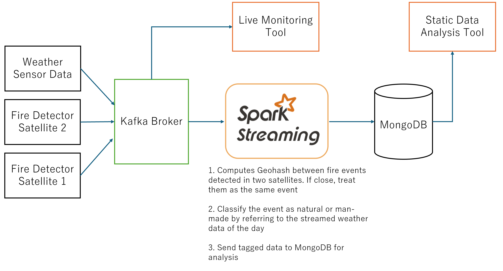

# Fire Stream App

A streaming preprocessing app and monitoring tool for fire events on earth. 

## Some functionalities:
1. When fire event is streamed to the app, it classifies fire event between man-made or natural, by comaprisng the geohash of the event locations.
2. The app stores the classification result together with the fire even record on MongoDB for later analysis/visualization.
3. To simulate the incoming weather data and fire data, we created three servers and Kafka producers. 

## Note on running the app:
- change host ip
- 27017 port to be open for MongoDB
- 9092 port to be open for Kafka
- 5000 port to be open for the Spark app

## TODO
- add dockerfile and docker-compose file

